# Command-Battle-in-RPG

RPGでのコマンド式のバトルを遊べるコンソールアプリケーションです。

使用言語：C言語

# ゲームの始め方
本アプリケーションはC言語で書かれているので、MAC OSの場合、通常のやり方でコンパイルしていただき、生成された実行ファイルを実行させてください。

例：MacOSの場合
```
gcc RPGHead.h RPGMain.c RPGArith.c
./a.out
```

アプリケーションに使用するテキストファイル、ソースコードはUTF-8で書かれているのでMAC OSでの動作を推奨します。
もし、Windowsで使用する場合は、全テキストファイルをShift-Jis(ANSI)に変換していただき、コンパイルと実行は以下のようにお願いします。

例：Windowsの場合
```
gcc RPGHead.h RPGMain.c RPGArith.c -finput-charset=UTF-8 -fexec-charset=CP932
a.exe
```

# ゲームの進め方
アプリケーションを実行させると以下のように表示されます。

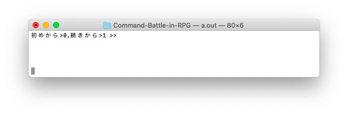

0を選択すると自分の名前を決めて、一から遊べます。
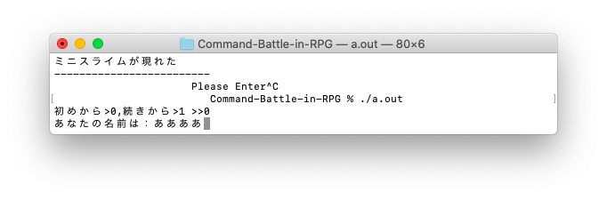

1を選択すると、セーブデータを読み込み、前回遊んだ続きから遊ぶことができます。

ゲームが始まると敵が出現し、敵、プレイヤーのHP、プレイヤーの選択肢が表示されます。

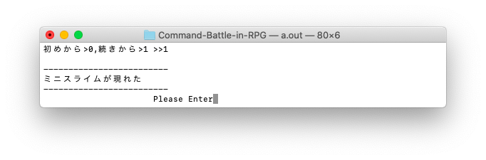

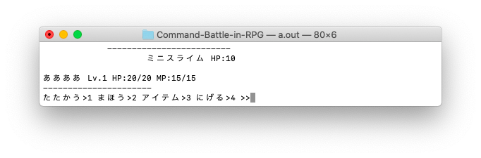

出現する敵はランダムで選択され、、プレイヤーのレベルが高くなると様々な敵が出現します。

選択肢は以下の４つです。
- たたかう
- まほう
- アイテム
- にげる

## たたかう
「たたかう」を選択すると、プレイヤーは敵に攻撃します。

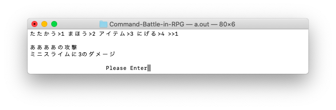

プレイヤーの行動後、敵が攻撃してきます。

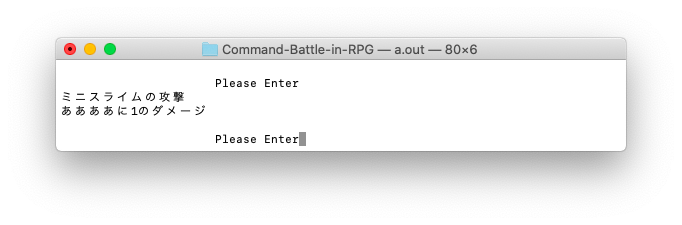

プレイヤーの攻撃で敵のHPが0になると、戦闘終了に移行します。

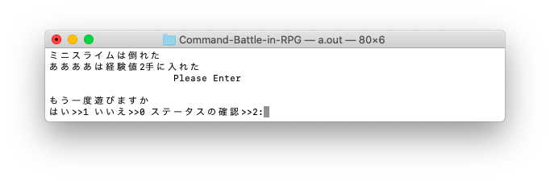

## まほう

「まほう」を選択すると、魔法選択肢が表示されます。

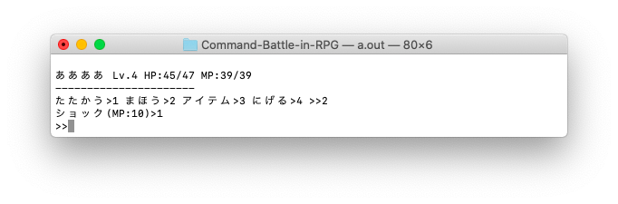

この時、魔法を覚えていない場合表示されません。

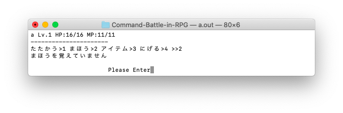

覚えている魔法を選択すると、魔法で攻撃します。

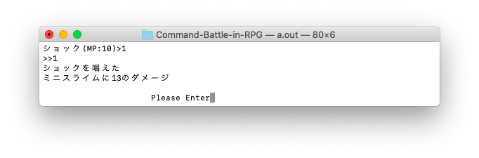

魔法攻撃後は「たたかう」と同じです。

プレイヤーの行動後、敵が攻撃してきます。


プレイヤーの魔法攻撃で敵のHPが0になると、戦闘終了に移行します。


## アイテム

「アイテム」を選択すると、アイテム選択肢が表示されます。

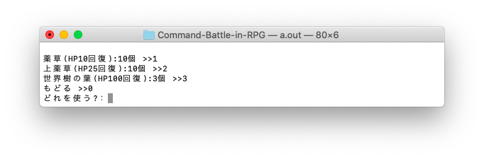

所持しているアイテムを選択するとHPが回復します。

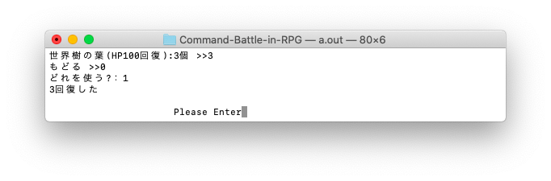

所持数が0のアイテムは使用できません。

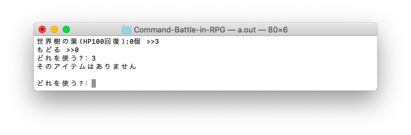

アイテム使用後は「たたかう」と同じです。

プレイヤーの行動後、敵が攻撃してきます。


## にげる
「にげる」を選択すると、確率で戦闘から逃げることができます。

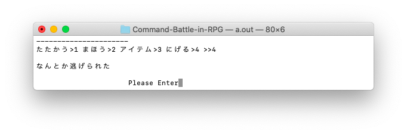

失敗することもあります。

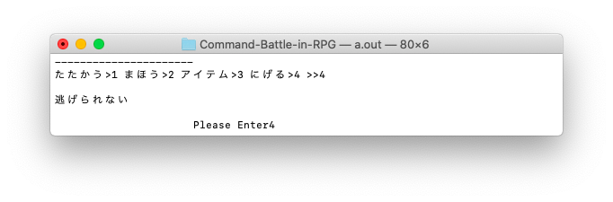

「逃げる」が失敗した場合、敵が攻撃してきます。


# 戦闘終了後
戦闘終了後、経験値が獲得でき、経験値が貯まるとレベルが上がることもあります。

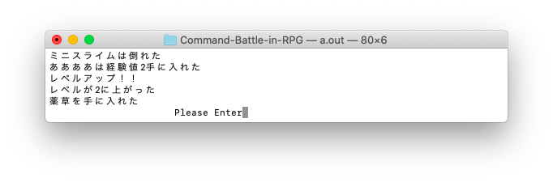

また確率でアイテムを取得することもあります。

その後、次の戦闘を始めるか、ゲームを終了するか、ステータスの確認が行えます。

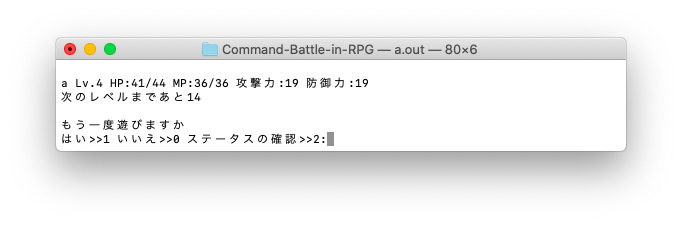

ステータスの確認ではレベル、現在のHP、最大HP、現在のMP、最大MP、攻撃力、防御力、次のレベルまでの経験値量が表示されます。

次の戦闘を始めると敵の出現から戦闘が開始します。

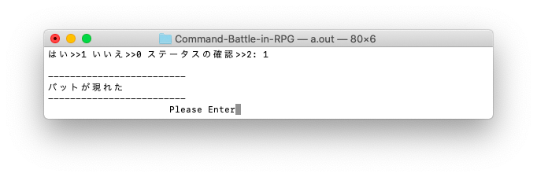
